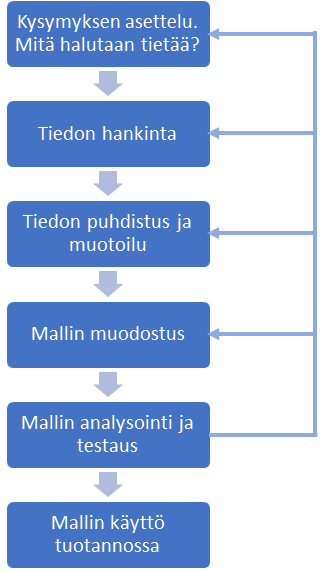
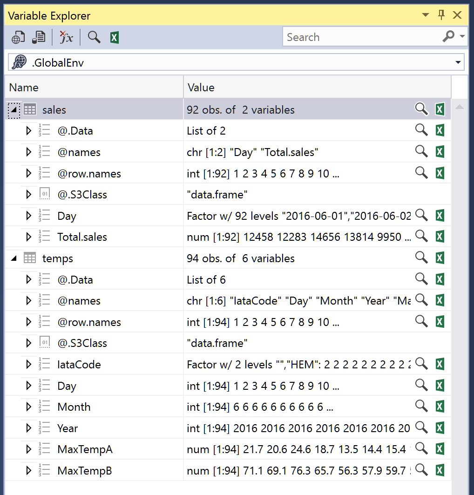
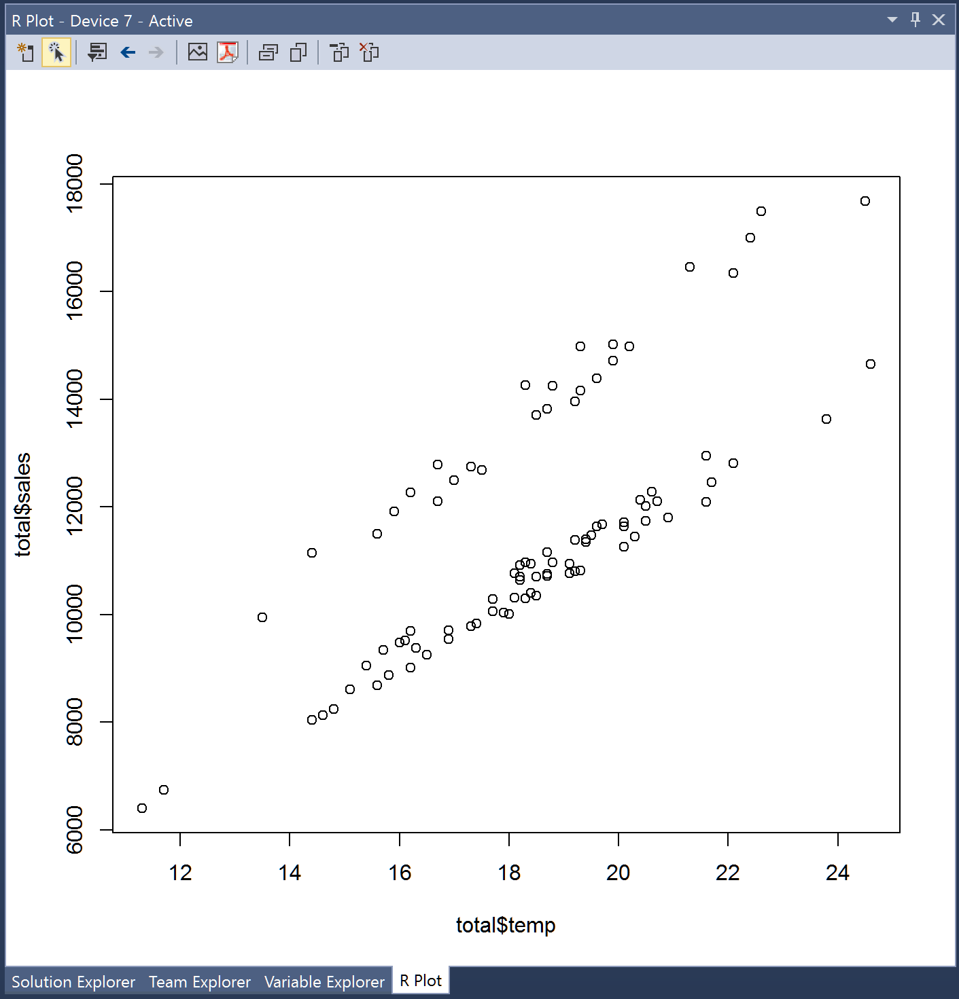
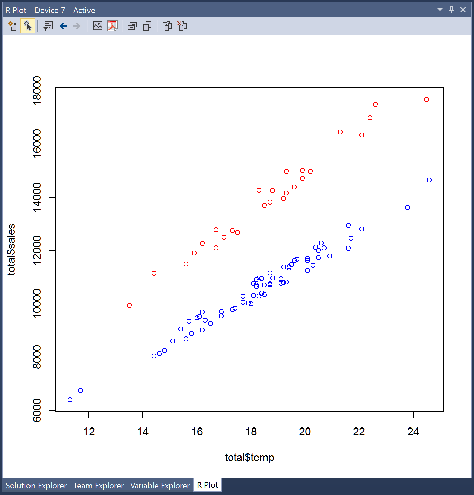

Koneoppimisen perusteet 
=====

Lyhyesti mitä koneoppiminen eli machine learning tarkoittaa
---

* Koneoppiminen tarkoittaa ensisijaisesti automaattisesti asioita oppivien algoritmien ja järjestelmien kehittämistä.
* Koneoppimisessa kerätyn tiedon eli **datan** avulla luodaan tilastollinen **malli**, jonka avulla on mahdollista ennustaa tulevia tapahtumia.
* Mallin voi ajatella yksinkertaisesti olevan kokoelma kaavoja ja vakioarvoja, jotka **koneoppimisalgoritmin** valitsee olemassa olevan datan avulla.
* Mallien käyttö eroaa perinteisestä staattisesta ohjelmoinnista (C#, Java etc.) ja on monia tilanteita, joissa perinteistä ohjelmointia ei voida käyttää. Esim. roskaposti-filtteriohjelman toteutus pohjautuu jatkuvasti muuttuvien tietojen analysointiin ja oppimiseen, ei staattisiin sääntöihin.

Mitä vaaditaan, jotta koneoppimisjärjestelmiä voi toteuttaa
--- 
* Koneoppimisjärjestelmiä toteutetaan useimmiten R-kielellä tai Pythonilla. Näistä suosittelen R-kieltä.
* Mikäli R-kieli ei ole entuudestaan tuttu, perusteet voi käydä läpi tämän materiaalin avulla https://github.com/nsdnwe/R-kielen-perusteet
* Koneoppimisjärjestelmien toteutus vaatii toteuttajalta myös jonkin verran tilastotieteen ymmärrystä.
* Koneoppimisjärjestelmiä voi suorittaa:
  * Kertaluonteisina ajoina työasemassa, mikäli datan määrä ei ole tähän liian suuri.
  * Palvelimessa, käyttämällä esim. [Microsoft R-server](https://docs.microsoft.com/en-us/r-server/what-is-microsoft-r-server) palvelinta.
  * Pilvipalvelussa, käyttämällä esim. [Microsoft Azure Machine Learning](https://azure.microsoft.com/en-us/services/machine-learning/) palvelua.

Koneoppimismenetelmät
=====

Koneoppimismenetelmät jaetaan kahteen perustyyppiin:

1. Ohjattu oppimismenetelmä (supervised learning)
  * Suurin osa koneoppimisjärjestelmistä perustuu ohjattuun oppimiseen.
  * Ohjatussa oppimisessa olemassa olevaa tietoa (dataa) käytetään koneoppimisalgoritmin opetusdatana. 
    * Esim. edellisten vuosien päivittäisiä jäätelön myyntimääriä ja ulkolämpötilatietoja voidaan käyttää mallinnettaessa miten päivän lämpötila vaikuttaa jäätelön myyntiin.
  * Tavoite ohjatussa oppimisessa on siis luoda malli, jolla voidaan ennustaa arvoja (value prediction).
  
2. Ohjaamaton oppimismenetelmä (unsupervied learning) 
  * Ohjaamaton oppiminen ei käytä selkeitä syöte-tulospareja eikä näin ollen vaadi opetusdataa ja on tyyliltään lähellä tiedonlouhintaa.
  * Ohjaamattomassa oppimisessa algoritmit pyrkivät löytämään yhtäläisyyksiä havaintodatasta ja tämän perusteella luokitella havaintoja klustereiksi.
  * Tavoite ohjaamattomassa oppimisessa on siis luoda malli, joka havaitsee saman tyyppisen datan klustereita (identify clusters of like data).
  

Koneoppimisalgoritmit
=====

* Koneoppimisalgoritmi on ohjelmakirjasto, joka opetusdatan perusteella muodostaa mallin.
* Algoritmejä on olemassa 70-80 kpl ja näistä löytyy lukuisia parametreja, joilla mallin luontia voi vielä hienosäätää.
* Varsinkin aloittelevalle koneoppimisen käyttäjälle oikean algoritmin valinta voi olla haastavaa. Muutamia hyviä linkkejä, joiden ohjeita voi hyödyntään valinnassa:
  * [MS Azure ML: Choose Algorithm](https://docs.microsoft.com/en-us/azure/machine-learning/machine-learning-algorithm-choice)
  * [MS Azure ML: Algorithm cheat sheet](https://docs.microsoft.com/en-us/azure/machine-learning/machine-learning-algorithm-cheat-sheet)

Kehitysympäristö
=====

R-kielellä toteutettavien koneoppimisjärjestelmien IDE eli kehitysympäristövaihtoehtoja löytyy useita. Näitä ovat mm:

[RStudio](https://www.rstudio.com/)
  * Eniten käytetty ja ilmainen kehitysympäristö.

[MS Visual Studio R tools](https://www.visualstudio.com/vs/rtvs/)
  * Mikäli käytät jo Visual Studiota, suosittelen asentamaan R tools lisäosan, jolloin kaikki ohjelmistokehitys tapahtuu samassa ympäristössä.
  * Toiminnaltaan ja ominaisuuksitaan R tools on hyvin samanlainen kuin RStudio.
  

Koneoppimisprosessi
===== 

Koneoppimisprosessi koostuu yleensä seuraavista vaiheista: 



Prosessi on iteratiivinen ja usein viimeistään mallin testausvaiheessa tulee tarve muokata lähtödataa, jotta mallin ennustustarkkuutta saadaan paremmaksi. Toisinaan tulee myös tarve arvioida uudelleen sitä, mitä koneoppimismallilla halutaan ennustaa, ovatko ennusteen rajaehdot riittävän selkeät ja onko edes mahdollista ennustaa haluttavia tietoja saatavilla olevalla datalla.

Helpoiten koneoppimisprosessin vaiheet ovat ymmärrettävissä esimerkkien avulla.

Kysymyksen asettelu
===

Mitä selkeämmin ja rajatummin voidaan määrittää se mitä halutaan ennustaa ja millä tiedoilla, sitä helpommaksi koneoppimisprosessi tulee.

Esimerkkikysymys:

**Mikä on ennustettu jäätelön päivittäinen myyntimäärä Helsingissä kesä-, heinä- ja elokuussa aikaisempien vuosien myyntimäärien perusteella huomioiden päivittäiset vaihtelut johtuen lämpötilasta?**

Tiedon hankinta
===

Koneoppimisprosessin alussa ei aina ole käytettävissä kaikkea sitä tietoa, jota prosessin toteutus vaatii ja tietoa joudutaan etsimään eri lähteistä. 

Mikäli koneoppimisprosessi liittyy yrityksen toimintaa, tiedon lähteinä ovat usein yrityksen omat tietokannat, operatiiviset järjestelmät, raportit ym.

Lisäksi on lukuisia organisaatioita ja yrityksiä, jotka tarjoavat ilmaista avointa dataa. Näitä ovat mm.
  * [Avoindata.fi](https://www.avoindata.fi) tarjoaa lukuisia julkishallinnon julkaisemia tietoaineistoja Suomesta.
  * https://www.data.gov USA:n hallinnon open data sivut.
  * http://www.opendata500.com/us/list USA:n 500 suurinta open data tarjoajaa.
  * http://opendataimpactmap.org/ Open data tarjoajia eri maista.

Avoimen datan lisäksi dataa on mahdollista ostaa kaupallisilta tietopalveluilta.
  
Harjoitus / Esimerkki
---
  
Seuraavissa esimerkissä käytämme kahta yrityksen omaa csv-muotoon tallennettua listaa, jotka ovat (kesä 2016, Helsinki):
  * Jäätelön myyntimäärät.
  * Päivittäiset maksimilämpötilat.
  
1. Tee koneellesi työkansio esim. `c:\ml-training` 
2. Tallenna kansioon seuraavat kaksi csv-tiedostoa:
  * [ic-sales-hki-2016-summer.csv](http://www.nsd.fi/ml/ic-sales-hki-2016-summer.csv)
  * [temperatures-hki-2016-summer.csv](http://www.nsd.fi/ml/temperatures-hki-2016-summer.csv)
3. Käynnistä ohjelmistokehitysympäristö
  * RStudio
    * Valitse "Start a project in brand new working directory".
    * Valitse työkansio.
  * Visual Studio
    * Aloita uusi projekti ja valitse Other langauges => R langauge.
    * Kun projekti on luotu, valitse oikea työkansio painamalla Ctrl+Shift+W.
4. Lataa csv-tiedostojen sisältö muistiin

```
temps <- read.csv(file = "temperatures-hki-2016-summer.csv", header = TRUE, sep = ";")
sales <- read.csv(file = "ic-sales-hki-2016-summer.csv", header = TRUE, sep = ";")
```

  * Huom. Voit suorittaa rivejä yksi kerrallaan painamalla Ctrl+Enter rivin kohdalla.
  
Tiedon puhdistus ja muokkaus
===  

Koneoppimisprosessiin käytettävästä ajasta kuluu yleensä suurin osa, jopa 80%, tiedon puhdistukseen ja muokkaukseen sellaiseen muotoon, että koneoppimisalgoritmit voivat sitä hyödyntää.

Muokkausta ovat mm.
  * Puuttuvien tietorivien havainnointi ja käsittely.
  * Päivämääräformaattien muunnos ja yhtenäistäminen.
  * Koodien yhtenäistäminen ja muunnos.
  * Turhien sarakkeiden ja rivien poisto. 
  * Arvojen skaalaus koneoppimisalgoritmien hyväksymille tasoille.
  * Tietojen yhdistäminen eri data frame:sta.
  * jne.
  
Seuraavissa esimerkeissä muokataan kahden data framen tietoja siten, että tiedot ovat yhdistettävissä yhdeksi data frameksi, turhat sarakkeet on poistettu ja vain mallin kannalta olennainen tieto on olemassa lopullisessa data framessa.

1. Katso funktiolla `head()`, miltä `temps` ja `sales`-data näyttää.

```
head(temps, 2)
head(sales, 2)
---
  IataCode Day Month Year MaxTempA MaxTempB
1      HEM   1     6 2016     21.7     71.1
2      HEM   2     6 2016     20.6     69.1

         Day Total.sales
1 2016-06-01    12457.91
2 2016-06-02    12282.79
```

Tarkempi kuvaus muuttujista on nähtävissä 
  * RStudion Workspace-välilehdellä.
  * Visual Studion Variable Explorer-panelissa.
    * Mikäli Variable Explorer ei ole näkyvillä, paina Ctrl+8.


    
Dataa silmämääräisesti tutkittaessa näyttää siltä, että `sales`-data on hyvälaatuista. `sales` sisältää vai sen mitä tarvitaan eli kunkin päivän myyntimäärät ja päiväyksent, jotka ovat valmiiksi oikeassa formaatissa. Ainoa havaittava virhe on, että päivämäärä on muotoa `Factor`, kun oikea muoto tulisi olla `Date`.

`temps`-data ei näytä niin hyvältä ja seuraavaksi tulee muokata se halutuun muotoon, jossa päiväys on samassa formaatissa kuin `sales`-datassa ja tämän lisäksi data frame:ssa on vain kunkin päivän maksimilämpötila. Ennen muokkausta tulee kuitenkin tutkia, mitä poistettavat datat ovat, ettei poisto johda virheellisiin päätelmiin. 

Variable Explorer näyttää myös, että `sales`-datassa on 92 riviä (obs. eli observations) ja `temps`-datassa 94. Syy tähän tulee selvittää.

Ylimääräisten rivien poisto
---

Koska `temps`-datassa on kaksi riviä enemmän kuin `sales`-datassa, on todennäköistä että joukossa on tyhjiä rivejä esim. kuvaamassa kuukauden vaihtumista. Mikäli dataa on suhteellisen vähän esim. vain muutamia satoja rivejä, tämän voi varmistaa silmämääriäisesti mutta suuremmissa datamäärissä on parempi käyttää funktiota.

2. Tutki funktiolla `is.na()` onko joukossa tyhjiä eli `NA`-rivejä

```
sum(is.na(temps$Day))
---
[1] 2
```

Rivejä löytyi 2 kappaletta. 

3. Poista ne, jonka jälkeen kummassakin data framessa on sama määrä rivejä.

```
temps <- na.omit(temps)
```
 
Ylimääräisten sarakkeiden poisto
---

Esimerkin `IataCode`-sarake vaikuttaa mittauspaikan koodilta ja on todennäköisesti sama kaikilla riveillä. 

4. Tutki funktiolla `subset()` onko rivejä, joissa on jokin muu koodi kuin `HEM`

```
subset(temps, IataCode != "HEM")
---
<0 rows> (or 0-length row.names)
```

Muita koodeja ei löytynyt, joten sarakkeen tieto on kaikilla riveilla sama ja näin ollen mallin luonnin kannalta turha. 

5. Poista turha sarake määrittämällä sen arvoksi `NULL`.

```
temps$IataCode <- NULL
```

Suoraan korreloivien sarakkeiden poisto
---
Mikäli kahdessa tai useammassa sarakkeessa on käytännössä sama arvo, esim. koodi ja koodin selitys, tulee toinen sarakkeista poistaa, jotta tämä tieto ei saa liikaa painoarvoa mallia muodostettaessa.

Temps datan `MaxTempA` ja `MaxTempB` näyttävät kuvaavan samaa tietoa, mutta on hyvä varmistaa, että ne korreloivat keskenään. 

6. Tutki funktiolla `cor.test()` ovatko `MaxTempA` ja `MaxTempB` käytännössä samoja tietoja

```
cor.test(temps$MaxTempA, temps$MaxTempB)
---
      cor 
0.9999777
```

Korrelaation on käytännössä 1, joten toinen sarake on mallin luonnin kannalta turha. 

7. Poista `MaxTempB`-sarake ja muuta `MaxTempA`-sarakkeen nimeksi pelkästään `temp` käyttämällä funtiota `colnames()`.

```
temps$MaxTempB <- NULL
colnames(temps)[colnames(temps) == "MaxTempA"] <- "temp"
```

Päivämääräsarakkeen luonti
---
`temps`-datassa päivämäärä on jaettuna kolmeen sarakkeeseen, jotka tulee yhdistää yhdeksi standardimuotoiseksi sarakkeeksi. Muoto tulee olla `yyyy-MM-dd`.

Muunnos täytyy tehdä ensin `ISOdate` muotoon, joka sisältää myös kellonajan, ja tämän jälkeen pelkäksi päivämääräksi funktiolla `as.Date()`.

8. Muodosta uusi sarake `date`, jossa on oikean muotoinen päivämäärä

```
temps$date <- as.Date(ISOdate(temps$Year, temps$Month, temps$Day))
```

9. Poista turhat `Day`, `Month` ja `Year` sarakkeet.

```
temps$Day <- NULL
temps$Month <- NULL
temps$Year <- NULL
```

Tiedon viimeistely
---

11. Tarkastele muokattua temps dataa funktiolla `head()` 

```
head(temps)
---
  temp       date
1 21.7 2016-06-01
2 20.6 2016-06-02
3 24.6 2016-06-03
4 18.7 2016-06-04
```
Tieto näyttää nyt hyvältä.

Vielä tulee muokata hieman `sales`-dataa.

12. Muokkaa `sales`-datan `Day` kentän sisältö muodosta `Factor` muotoon `Date` ja muuta sarakkeen nimeksi `date`. Muuta `Total.sales`-sarakkeen nimeksi `sales`.

```
sales$Day <- as.Date(sales$Day)
colnames(sales)[colnames(sales) == "Day"] <- "date"
colnames(sales)[colnames(sales) == "Total.sales"] <- "sales"
```

Kahden data framen yhdistäminen
---

Nyt kun kummassakin data framessa on päivämäärät samassa formaatissa, on mahdollista yhdistää tiedot yhdeksi data frameksi funktiolla `merge()`.

13. Yhdistä data framet ja tarkasta tiedon sisältö

```
total <- merge(temps, sales, by = "date")
head(total)
---
        date temp     sales
1 2016-06-01 21.7 12457.909
2 2016-06-02 20.6 12282.788
3 2016-06-03 24.6 14655.560
```

Datan sopivuuden arviointi
---

Pelkkinä numeroarvoina on vaikea arvioida, onko data nyt muodossa, josta on helppo muodostaa malli. Arviointia voi tehdä seuraavasti:
  * Muodostamalla datasta diagrammeja ja tätä kautta silmämääräisesti analysoida dataa.
  * Muodostamalla datasta jonkin koneoppimisalgoritmin avulla mallin ja testidatan avulla tutkia kuinka hyvin muodostettu malli korreloi olemassa olevan datan kanssa.

Aloitetaan diagrammin käytöllä ja myöhemmin tutkitaan dataa opetus- ja testidatan avulla.

Diagrammin muodostaminen
---

14. Muodosta datasta diagrammi, jossa x-akselillä on lämpötila ja y-akselilla myyntimäärä. Käytä funktionta `plot()`.

```
plot(x = total$temp, y = total$sales)
```


Datan visuaalinen analysointi
---
Diagrammista on havaittavissa, että data ei asetu yhdelle linjalle tai kaarelle vaan sisältää selkeästi kaksi korreloivaa tasoa. Mistä tämä johtuu?

15. Tutki dataa rivi kerrallaan ja selvitä, mistä edellä kuvattu ilmiö voisi johtua. 

```
head(total, 25)
```

Lyhyen selailun jälkeen ilmenee, että lauantaina ja sunnuntaina jäätelön myynti on selkeästi korkeampaa kuin arkipäivisin. 

Datan sisällön tarkennus
--- 

Näin ollen hyvän mallin muodostukseen tarvitaan lisäksi sarake, joka kuvaa kunkin rivin osalta onko kysessä viikonloppu vai ei.

16. Lisää uusi sarake, joka kuvaa `TRUE`/`FALSE` (totuusmuuttujan) avulla, onko kyseinen päivä lauantaina tai sunnuntaina.

```
total$wd <- weekdays(total$date)
total$weekend <- (total$wd == "lauantai" | total$wd == "sunnuntai" | total$wd == "saturday" | total$wd == "sunday")
total$wd <- NULL
```
17. Tarkastele diagrammia siten, että viikonloppujen myyntimäärät ovat merkittynä punaisella ja arkipäivät sinisellä

```
plot(x = total$temp, y = total$sales, col = ifelse(total$weekend, "red", "blue"))
```


Analyysi oli oikea, eli viikonloppuisin myynti on selkeästi suurenpaa kuin arkisin.

18. Poista vielä mallin kannalta turha sarake date

```
total$date <- NULL
```

Mallin muodostus
=====

Algoritmin valinta
---

Ensimmäinen vaihe mallin muodostuksessa on päättää mitä koneoppimisalgoritmia tulee käyttää. Koska koneoppimisprosessi on iteratiivinen, voi olla tarpeellista vaihtaa algoritmia, mikäli valittu algoritmi ei anna riittävän hyviä tuloksia.

Esimerkkinä käytettävän datan käsittelyyn sopii ehkä eniten koneoppimisessa käytetty **Linear regression** (Multiple linear regression) algoritmi.

Opetus ja testausdatan muodostus
---

Yleensä malliin käytettävä data jaetaan siten, että n. 70% datasta käytetään algoritmin opetukseen ja 30% mallin testaukseen. 

1. Jaa data satunnaisesti train ja test data frameen 

```
set.seed(1234)
ix <- sample(x = 1:92, size = 60)
train <- total[ix,]
test <- total[-ix,]
```

* `set.seed()` funktio antaa satunnaisluvuille "alkuarvon", jolloin mallia uudelleen muodostettaessa saadaan aina samat satunnaisarvot.
* `sample()` funktio muodostaa 60 kpl satunnaisia numeroita välillä 1-92. Sama numero esiintyy vektorissa vai yhden kerran.
* Käytettäessä miinusta indeksin edessä `-ix` valitaan kaikkin ne indeksit, jotka eivät esiinny `ix` listalla.

Toinen vaihtoehto jakaa data on käyttää funktiota `createDataPartition()`.

```
ix <- createDataPartition(total$sales, p = .70, list = FALSE, times = 1) 
```
 
2. Tarkasta train ja test data framen sisältö

```
head(train)
head(test)
```

Mallin muodostus
---

Linear regressin mallin muodostus tapahtuu funktion `lm()` avulla.

3. Muodosta malli

```
model <- lm(data = train, formula = sales ~ temp + weekend)
```

`formula = sales ~ temp + weekend` paramerilla määritetään 
  * y-akselin arvoksi päivän myyntimäärä eli sales. Vertaa matemaattisten algoritmien määrittelyssä f(x) = jne...
  * Muuttujat, jotka vaikuttavat y:n arvoon listataan aalto-merkin jälkeen. Tässä + ei tarkoita yhteenlaskua vaan sillä lisätään uusi muuttuja mallin muodostukseen.
  * Mikäli analysoitavassa datassa ei ole ylimääräisiä sarakkeita, voi käyttää myös muotoa `formula = sales ~ .`, jossa piste tarkoittaa, että kaikki loput muuttujat otetaan mukaan mallin muodostukseen.

4. Analysoi mallin toimivuutta `summary()` funktion avulla

```
summary(model)
---
Residuals:
    Min      1Q  Median      3Q     Max 
-557.46 -210.39   -0.36  148.72  756.31 

Coefficients:
            Estimate Std. Error t value Pr(>|t|)    
(Intercept) -1310.05     315.78  -4.149 0.000113 ***
temp          647.33      16.76  38.621  < 2e-16 ***
weekendTRUE  3228.58      92.63  34.855  < 2e-16 ***
---
Signif. codes:  0 '***' 0.001 '**' 0.01 '*' 0.05 '.' 0.1 ' ' 1

Residual standard error: 287 on 57 degrees of freedom
Multiple R-squared:  0.9795,	**Adjusted R-squared:  0.9788** 
F-statistic:  1363 on 2 and 57 DF,  p-value: < 2.2e-16
```

Adjusted R-squared muuttujan arvo kertoo lyhyesti miten hyvä malli on. Mitä lähenpänä numeroa 1 arvo on, sitä parempi malli.

Mallin testaus
=====

Mallin toimivuuden testaus suoritetaan testidatalla, joka luotiin ennen mallin muodostusta.

Testauksessa idea on ennustaa sales arvoja testidatan temp ja weekend tietojen perusteella. Kun ennustus on tehty, sitä verrataan testidatan oikeaan sales arvoon. Mitä lähenpänä ennustukset keskimäärin ovat oikeita arvoja, sitä paremmin malli osaa ennustaa.

1. Luo ennustuksia `predict()` funktion avulla testidatasta

```
predictions <- predict(object = model, newdata = test)
```

2. Tutki ennustusten tuloksia vertaamalla ennustetun ja testidatan arvoja

```
SSE <- sum((test$sales - predictions) ^ 2) # Sum of squared errors of prediction
SST <- sum((test$sales - mean(test$sales)) ^ 2) # Total sum of squares
1 - SSE / SST
---
[1] 0.9782878
```

Osoittautuu siis, että malli ennustaa oikein **97,8%** tarkkuudella eli on erittäin hyvä.

Mallin hyödyntäminen tuotannossa
=====

* Mallille on mahdollista luoda web-käyttöliittymä esim. RStudion tarjoaman ilmaisen [Shiny](http://shiny.rstudio.com/) tuotteen avulla.
* Mallia voi käyttää [Microsoft R server](https://docs.microsoft.com/en-us/r-server/) sekä [Microsoft Azure](https://docs.microsoft.com/en-us/azure/machine-learning/machine-learning-r-quickstart) ympäristöissä.
* Yksittäisiä ennustusarvoja voi laskea suoraan RStudiossa sekä Visual Studiossa.

1. Laske arvioitu myyntimäärä, mikäli lämpötila on 25 astetta ja on viikonloppu
```
predict(object = model, data.frame(temp = 25, weekend = TRUE))
---
18101.65
```

NSD Consulting Oy
-----

**Vaativien asiakasohjelmistojen suunnittelu ja toteutus**

www.nsd.fi
