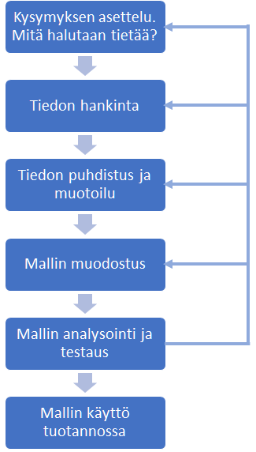
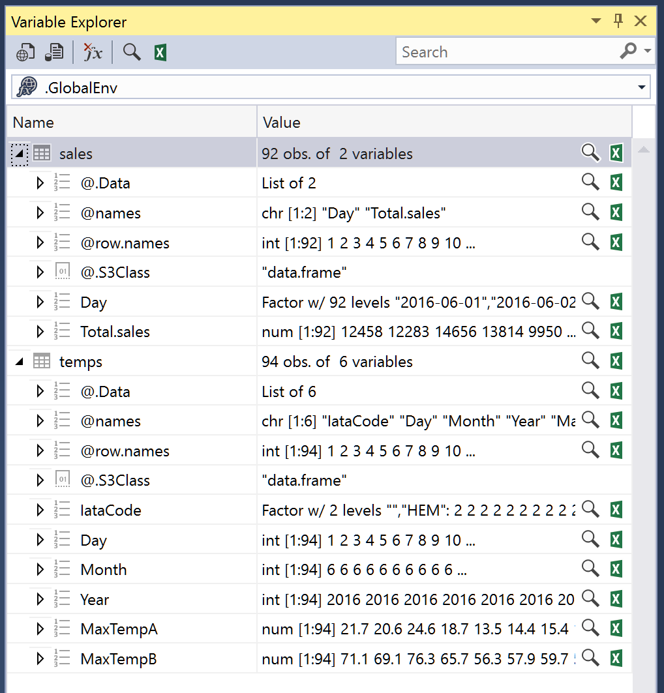
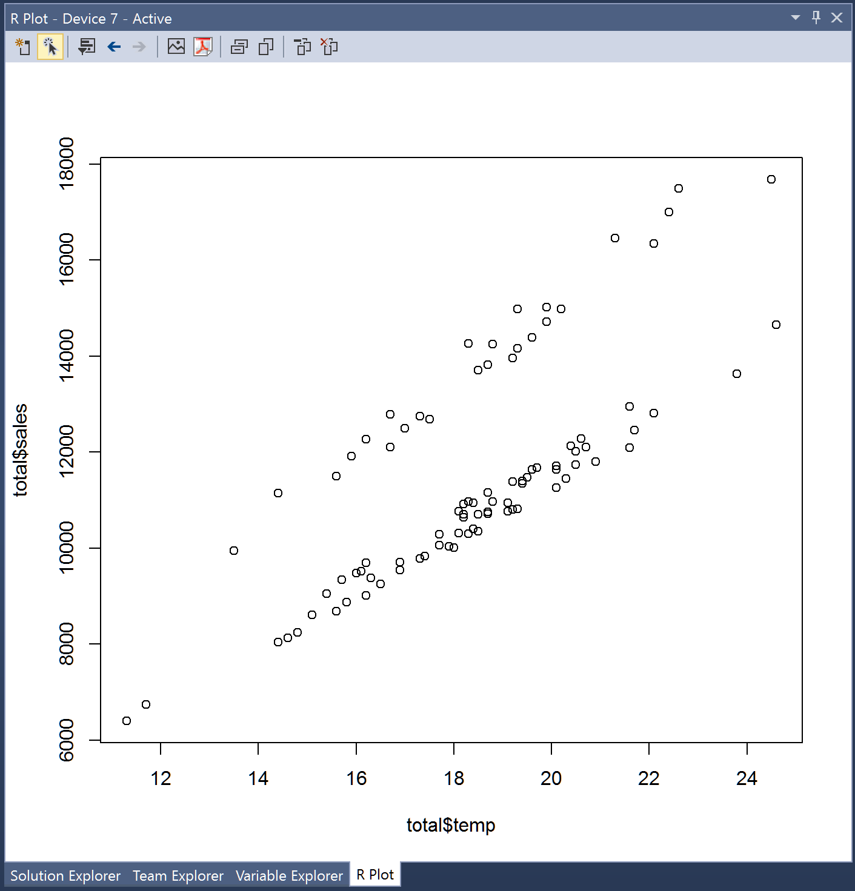

Koneoppimisen perusteet 
=====

Lyhyesti mitä koneoppiminen on?
---

* Kerätyn tiedon (datan) avulla rakennetaan tilastollinen **malli**, jonka avulla on mahdollista ennustaa tulevia tapahtumia.
* Mallien käyttö eroaa perinteisestä staattisesta ohjelmoinnista (C#, Java etc.) ja on monia tilanteita, joissa perinteistä ohjelmointia ei voida käyttää. 
  * Esim. roskaposti-filtteriohjelman toteutus pohjautuu jatkuvasti muuttuvien tietojen analysointiin ja oppimiseen, ei staattisiin sääntöihin.

Mitä vaaditaan, jotta koneoppimisjärjestelmiä voi toteuttaa?
--- 
* Koneoppimisjärjestelmiä toteutetaan useimmiten R-kielellä tai Pythonilla. Näistä suosittelen käyttämään R-kieltä, joka on eniten käytetty ja johon löytyy runsaasti ilmaisia koneoppimiseen liittyviä kirjastoja
* Mikäli R-kieli ei ole entuudestaan tuttu, perusteet voi käydä läpi esim. tämän materiaalin avulla https://github.com/nsdnwe/R-kielen-perusteet
* Koneoppimisjärjestelmien toteutus vaatii toteuttajalta myös jonkin verran tilastotieteen perusteiden ymmärrystä.
* Koneoppimisjärjestelmiä voi suorittaa:
  * Kertaluonteisina ajoina työasemassa, mikäli datan määrä ei ole tähän liian suuri.
  * Palvelimessa, käyttämällä esim. [Microsoft R-server](https://docs.microsoft.com/en-us/r-server/what-is-microsoft-r-server) palvelinta.
  * Pilvipalvelussa, käyttämällä esim. [Microsoft Azure Machine Learning](https://azure.microsoft.com/en-us/services/machine-learning/) palvelua.

Koneoppimismenetelmät
=====

Koneoppimismenetelmät jaetaan kahteen perustyyppiin:

1. Ohjattu oppimismenetelmä (supervised learning)
  * Suurin osa koneoppimisjärjestelmistä perustuu ohjattuun oppimiseen.
  * Ohjatussa oppimisessa olemassa olevaa tietoa käytetään koneoppimisalgoritmin opetusdatana. 
    * Esim. edellisten vuosien päivittäisiä jäätelön myyntimääriä ja ulkolämpötilatietoja voidaan käyttää haluttaessa mallintaa miten päivän lämpötila vaikuttaa jäätelön kulutukseen
  * Tavoite ohjatussa oppimisessa on siis luoda malli, jolla voidaan ennustaa arvoja (value prediction)
  
2. Ohjaamaton oppimismenetelmä (unsupervied learning) 
  * Ohjaamaton oppiminen ei käytä selkeitä syöte-tulospareja eikä näin ollen vaadi opetusdataa ja on tyyliltään lähellä tiedonlouhintaa
  * Ohjaamattomassa oppimisessa algoritmit pyrkivät löytämään yhtäläisyyksiä datasta ja tämän perusteella luokitella tietoa klustereiksi
  * Tavoite ohjaamattomassa oppimisessa on siis luoda malli, joka havaitsee saman tyyppisen datan klustereita (identify clusters of like data)
  

Koneoppimisalgoritmit
=====

* Koneoppimisalgoritmi on ohjelmakirjasto, joka opetusdatan perusteella muodostaa mallin.
* Algoritmejä on olemassa 70-80 kpl ja näistä löytyy lukuisia parametreja, joilla mallin luontia voi vielä hienosäätää
* Varsinkin aloittelevalle koneoppimisen käyttäjälle oikean algoritmin valinta voi olla haastavaa. Muutamia hyviä linkkejä, joiden ohjeita voi hyödyntään valinnassa
  * [MS Azure ML Choose Algorithm](https://docs.microsoft.com/en-us/azure/machine-learning/machine-learning-algorithm-choice)
  * [MS Azure ML Algorithm cheat sheet](https://docs.microsoft.com/en-us/azure/machine-learning/machine-learning-algorithm-cheat-sheet)

Kehitysympäristö
=====

R-kielellä toteutettavien koneoppimisjärjestelmien kehitysympäristövaihtoehtoja löytyy useita. Hyviä vaihtoehtoja ovat mm:

[RStudio](https://www.rstudio.com/)
  * Eniten käytetty ja ilmainen kehitysympäristö

[MS Visual Studio R tools](https://www.visualstudio.com/vs/rtvs/)
  * Mikäli käytät jo Visual Studiota, suosittelen asentamaan R tools lisäosan, jolloin kaikki ohjelmistokehitys tapahtuu samassa ympäristössä
  * Toiminnaltaan ja ominaisuuksitaan R tools on hyvin samanlainen kuin RStudio
  

Koneoppimisprosessi
===== 

Koneoppimisprosessi koostuu yleensä seuraavista vaiheista: 



Prosessi on iteratiivinen ja usein viimeistän mallin testausvaiheessa tulee tarve muokata lähtödataa tai joskus arvioida uudelleen sitä, mitä koneoppimismallilla halutaan ennustaa.

Helpoiten prosessin vaiheet ovat ymmärrettävissä esimerkkien avulla.

Kysymyksen asettelu
===

Mitä selkeämmin ja rajatummin ennustettava tieto voidaan määrittää,  sitä helpommaksi koneoppimisprosessi tulee.

Esimerkkikysymys:

**Mikä jäätelön päivittäinen myyntimäärä Helsingissä kesä-, heinä- ja elokuussa aikaisempien vuosien myyntimäärien perusteella huomioiden päivittäiset vaihtelut johtuen ulkolämpötilasta?**

Tiedon hankinta
===

Tiedon lähteitä ovat mm:
  * Yrityksen omat tietokannat ja operatiiviset järjestelmät
  * [Avoindata.fi](https://www.avoindata.fi) tarjoaa lukuisia julkishallinnon julkaisemia tietoaineistoja Suomesta
  * https://www.data.gov USA:n hallinnon open data sivut
  * [Open data 500](http://www.opendata500.com/us/list) USA:n 500 suurinta open data tarjoajaa
  * http://opendataimpactmap.org/ Open data tarjoajia eri maista

Esimerkissä käytämme kahta yrityksen omaa tiedon lähdettä:
  * Jäätelön myyntimäärät
  * Päivittäiset maksimilämpötilat 
  
1. Tee koneellesi työkansio esim. `c:\ml-training` 
2. Tallenna kansioon seuraavat kaksi csv-tiedostoa:
  * [ic-sales-hki-2016-summer.csv](http://nsd.fi/ml/ic-sales-hki-2016-summer.csv)
  * [temperatures-hki-2016-summer.csv](http_//nsd.fi/ml/temperatures-hki-2016-summer.csv)
3. Käynnistä ohjelmistokehitysympäristö
  * RStudiossa
    * Valitse "Start a project in brand new working directory"
    * Valitse työkansio
  * Visual Studiossa
    * Aloita uusi projekti ja valitse: Other langauges => R langauge
    * Kun projekti on luotu, määritä työkansio painamalla Ctrl+Shift+W
4. Lataa csv-tiedostojen sisältö muistiin
  * Huom. Voit suorittaa rivejä yksi kerrallaan painamalla Ctrl+Enter rivin kohdalla

```
# To change working directory in RStudio: setwd("c:/ml-training")
# To change working directory in VS: Press Ctrl+Shift+W

temps <- read.csv(file = "temperatures-hki-2016-summer.csv", header = TRUE, sep = ";")
sales <- read.csv(file = "ic-sales-hki-2016-summer.csv", header = TRUE, sep = ";")
```
  
Tiedon puhdistus ja muokkaus
===  

Koneoppimisprosessiin käytettävästä ajasta kuluu yleensä suurin osa, jopa 80%, tiedon puhdistukseen ja muokkaukseen sellaiseen muotoon, että koneoppimisalgoritmit voivat sitä hyödyntää.

Muokkausta on mm:
  * Puuttuvien tietorivien havannonti ja käsittely
  * Päivämäärä- ja desimaaliformaattien muunnos ja yhtenäistäminen
  * Koodien yhtenäistäminen ja muunnos
  * Turhien sarakkeiden ja rivien poisto 
  * Arvojen skaalaus
  * Usemmaan data frame yhdistäminen
  * jne.
  
Seuraavissa esimerkeissä muokataan kahden data framen tietoja siten, että tiedot ovat yhdistettävissä yhdeksi data frameksi, turhat sarakkeet on poistettu ja vain mallin kannalta olennainen tieto on olemassa.

1. Katso funktiolla `head()`, miltä temps ja sales data näyttää.

```
head(temps, 2)
head(sales, 2)
---
  IataCode Day Month Year MaxTempA MaxTempB
1      HEM   1     6 2016     21.7     71.1
2      HEM   2     6 2016     20.6     69.1
> head(sales, 2)
         Day Total.sales
1 2016-06-01    12457.91
2 2016-06-02    12282.79
```

Tarkempi kuvaus muuttujista on nähtävissä 
  * RStudion Workspace-välilehdellä
  * Visual Studion Variable Explorer-panelissa
    * Mikäli Variable Explorer ei ole näkyvillä, paina Ctrl+8


    
Dataa silmämääräisesti tutkittaessa näyttää siltä, että Sales data on hyvälaatuista. Sales sisältää vai sen mitä tarvitaan eli päiväys oikeassa formaatissa ja kunkin päivän myyntimäärän. Ainoa havaittava virhe on, että päivämäärä on muotoa Factor, kun oikea muoto tulisi olla Date.

Temps data ei näytä niin hyvältä ja seuraavaksi tulee muokata se halutuun muotoon, jossa on päiväys samassa formaatissa kuin Sales datassa ja lisäksi on vain kunkin päivän maksimi-lämpötila. Ennen muokkausta tulee kuitenkin tutkia, mitä poistettava data on, ettei poisto johda virheellisiin päätelmiin. 

Variable Explorer näyttää myös, että Sales datassa on 92 riviä (observations) ja Temps datassa 94. Syy tähän tulee selvittää.

Ylimääräisten rivien poisto
---

Koska Temps datassa on kaksi riviä enemmän kuin Sales datassa, on todennäköistä että joukossa on tyhjiä rivejä esim. kuvaamassa kuukauden vaihtumista. Tämän voi varmistaa pienellä datalla silmämääriäisesti mutta suuremmissa datoissa on parempi käyttää funktiota.

2. Tutki funktiolla `is.na()` onko joukossa tyhjiä (NA) rivejä

```
sum(is.na(temps$Day))
---
[1] 2
```

Rivejä löytyi 2 kappaletta. 

3. Poista ne, jonka jälkeen kummassakin data framessa on sama määrä rivejä.

```
temps <- na.omit(temps)
```
 
Ylimääräisten sarakkeiden poisto
---

Esimerkin IataCode sarake vaikuttaa mittauspaikan koodilta ja on todennäköisesti sama kaikilla riveillä. 

4. Tutki funktiolla `subset()` onko rivejä, joissa on jokin muu koodi kuin "HEM"

```
subset(temps, IataCode != "HEM")
---
<0 rows> (or 0-length row.names)
```

Muita koodeja ei löytynyt, joten sarake on mallin luonnin kannalta turha. 

5. Poista turha sarake määrittämällä sen arvoksi NULL.

```
temps$IataCode <- NULL
```

Suoraan korreloivien sarakkeiden poisto
---
Mikäli kahdessa tai useammassa sarakkeessa on käytännössä sama arvo, esim. koodi ja koodin selitys, tulee toinen sarakkeista poistaa, jotta tämä tieto ei saa turhaan liikaa painoarvoa mallia muodostettaessa.

Temp datan MaxTempA ja MaxTempB näyttävät kuvaavan samaa tietoa, mutta on hyvä varmistaa, että ne korreloivat keskenään. 

6. Tutki funktiolla `cor.test()` ovatko MaxTempA ja MaxTempB käytännössä samoja tietoja

```
cor.test(temps$MaxTempA, temps$MaxTempB)
---
      cor 
0.9999777
```

Korrelaation on käytännössä 1, joten toinen sarake on mallin luonnin kannalta turha. 

7. Poista MaxTempB sarake ja muuta MaxTempA sarakkeen nimeksi pelkästään temp käyttämällä funtiota `colnames()`.

```
temps$MaxTempB <- NULL
colnames(temps)[colnames(temps) == "MaxTempA"] <- "temp"

```

Päivämääräsarakkeen luonti
---
Temps datassa päivämäärä on jaettuna kolmeen sarakkeeseen, jotka tulee yhdistää yhdeksi standardimuotoiseksi sarakkeeksi. Muoto tulee olla yyyy-MM-dd.

Muunnos täytyy tehdä ensin `ISOdate` muotoon, joka sisältää myös kellonajan, ja tämän jälkeen pelkäksi päivämääräksi funktiolla `as.Date()`.

8. Muodosta uusi date sarake, jossa on oikea päivämäärä

```
temps$date <- as.Date(ISOdate(temps$Year, temps$Month, temps$Day))
```

9. Poista turhat Day, Month ja Year sarakkeet.

```
temps$Day <- NULL
temps$Month <- NULL
temps$Year <- NULL
```

Tiedon viimeistely
---

11. Tarkastele muokattua temps dataa funktiolla `head()` 

```
head(temps)
---
  temp       date
1 21.7 2016-06-01
2 20.6 2016-06-02
3 24.6 2016-06-03
4 18.7 2016-06-04
```
Tieto näyttää nyt hyvältä.

Vielä tulee muokata hieman Sales dataa.

12. Muokkaa Sales datan Day kentän sisältä muodosta Factor muotoon Date ja muuta sarakkeen nimeksi date. Muuta Total.sales sarakkeen nimeksi sales.

```
sales$Day <- as.Date(sales$Day)
colnames(sales)[colnames(sales) == "Day"] <- "date"
colnames(sales)[colnames(sales) == "Total.sales"] <- "sales"
```

Kahden data framen yhdistäminen
---

Nyt kun kummassakin data framessa on päivämäärät samassa formaatissa, on mahdollista yhdistää tiedot yhdeksi data frameksi funktiolla `merge()`.

13. Yhdistä data framet ja tarkasta tiedon sisältö

```
total <- merge(temps, sales, by = "date")
head(total)
---
        date temp     sales
1 2016-06-01 21.7 12457.909
2 2016-06-02 20.6 12282.788
3 2016-06-03 24.6 14655.560
```

Nyt samassa dataframessa on kaikki data. 

Datan sopivuuden arviointi
---

Pelkkinä numeroarvoina on vaikea arvioida, onko data nyt muodossa, josta on helppo muodostaa malli. Arviointia voi tehdä seuraavasti
  * Muodostamalla diagrammin datasta ja silmämääräisesti tutkia dataa
  * Muodostamalla mallin käyttämällä osaa datasta ja tutkia kuinka hyvin se korreloin lopun datan kanssa

Aloitetaan diagrammin käytöllä ja myöhemmin tutkitaan dataa opetus- ja testausdatan avulla.

Diagrammin muodostaminen
---

14. Muodosta datasta diagrammi, jossa x-akselillä on lämpötila ja y-akselilla myyntimäärä. Käytä funktionta `plot()`.

```
plot(x = total$temp, y = total$sales)
```


Datan visuaalinen analysointi
---
Diagrammista on havaittavissa, että data ei asetu yhdelle linjalle tai kaarelle vaan sisältää selkeästi kaksi korreloivaa tasoa. Mistä tämä johtuu?

15. Tutki dataa rivi kerrallaan ja selvitä, mistä edellä kuvattu ilmiö voisi johtua. 

```
head(total)
```

Lyhyen selailun jälkeen ilmenee, että lauantaina ja sunnuntaina jäätelön myynti on selkeästi korkeampaa kuin arkipäivisin. 

Datan sisällön tarkennus
--- 

Näin ollen hyvä mallin muodostukseen tarvitaan lisäksi sarake, joka kuvaa kunkin rivin osalta onko kysessä viikonloppu vai ei.

16. Lisää uusi sarake, joka kuvaa TRUE/FALSE (boolean / totuusmuuttujan) avulla, onko kyseinen päivä lauantaina tai sunnuntaina.

```
total$wd <- weekdays(total$date)
total$weekend <- (total$wd == "lauantai" | total$wd == "sunnuntai" | total$wd == "saturday" | total$wd == "sunday")
total$wd <- NULL
```
17. Tarkastele diagrammia siten, että viikonloppujen myyntimäärät ovat merkittynä punaisella ja arkipäivät sinisellä

```
plot(x = total$temp, y = total$sales, col = ifelse(total$weekend, "red", "blue"))
```


Analyysi oli oikea, eli viikonloppuisin myynti on selkeästi suurenpaa kuin arkisin.

18. Poista vielä mallin kannalta turha sarake day

```
total$date <- NULL
```

Mallin muodostus
=====

Algoritmin valinta
---

Ensimmäinen vaihe on mallin muodostuksessa on päättää mitä koneoppimisalgoritmia tulee käyttää. Koska koneoppimisprosessi on iteratiivinen, voi olla tarpeellista vaihtaa algoritmia mikäli valittu algoritmi ei anna riittävän hyviä tuloksia.

Esimerkkinä käytettävän datan käsittelyyn sopii **linear regression** algoritmi.

Opetus ja testausdatan muodostus
---

Yleensä malliin käytettävä data jaetaan siten, että n. 70% datasta käytetään mallin algoritmin opetukseen ja 30% mallin testaukseen. 

1. Jaa data satunnaisesti train ja test data frameen 

```
set.seed(1234)
ix <- sample(x = 1:92, size = 60)
train <- total[ix,]
test <- total[-ix,]
```

* ´set.seed()` funktio antaa satunnaisluvuille "alkuarvon", jolloin uudelleen uudelleen mallia muodostettaessa saadaan samat satunnaisarvot
* ´sample()´ funktio muodostaa 60 kpl satunnaisia numeroita välillä 1-92. Sama numero esiintyy vai yhden kerran
* Käytettäessä miinusta indeksin edessä valitaan kaikkin ne indeksit, jotka eivät esiinny `ix` listalla

Toinen vaihtoehto on käyttää `createDataPartition()` funktiota

```
ix <- createDataPartition(total$sales, p = .70, list = FALSE, times = 1) 
```
 
2. Tarkasta train ja test data framen sisältö

```
head(train)
head(test)
```

Mallin muodostus
---

Linear regressin mallin muodostus tapahtuu `lm()` funktion avulla.

3. Muodosta malli

```
model <- lm(data = train, formula = sales ~ temp + weekend)
```

`formula = sales ~ temp + weekend` paramerilla määritetään 
  * y-akselin arvoksi sales. Vertaa matemaattisten algoritmien määrittelyssä f(x) = jne..
  * Muuttujat, jotka vaikuttavat y:n arvoon listataan aalto-merkin jälkeen. Tässä + ei tarkoita yhteenlaskua vaan sillä lisätään uusi muuttuja mallin muodostukseen
  * Mikäli analysoitavassa datassa ei ole ylimääräisiä sarakkeita, voi käyttää myös muotoa `formula = sales ~ .`, jossa piste tarkoittaa, että kaikki loput muuttujat otetaan mukaan mallin muodostukseen

4. Analysoi mallin toimivuutta `summary()` funktion avulla

```
summary(model)
---
Residuals:
    Min      1Q  Median      3Q     Max 
-557.46 -210.39   -0.36  148.72  756.31 

Coefficients:
            Estimate Std. Error t value Pr(>|t|)    
(Intercept) -1310.05     315.78  -4.149 0.000113 ***
temp          647.33      16.76  38.621  < 2e-16 ***
weekendTRUE  3228.58      92.63  34.855  < 2e-16 ***
---
Signif. codes:  0 '***' 0.001 '**' 0.01 '*' 0.05 '.' 0.1 ' ' 1

Residual standard error: 287 on 57 degrees of freedom
Multiple R-squared:  0.9795,	**Adjusted R-squared:  0.9788** 
F-statistic:  1363 on 2 and 57 DF,  p-value: < 2.2e-16
```

Adjusted R-squared muuttujan arvo kertoo lyhyesti miten hyvä malli on. Mitä lähenpänä numero 1 arvo on, sitä parempi malli.

Mallin testaus
=====

Mallin toimivuuden testaus suoritetaan testidatalla, joka luotiin mallia muodostettaessa.

Testauksessa idea on ennustaa sales arvoja testidatan temp ja weekend tietojen perusteella. Kun ennustus on tehty, sitä verrataan testidatan oikeaan sales arvoon. Mitä lähenpänä ennustus on oikeaa arvoa, sitä paremmin malli osaa ennustaa.

1. Luo ennustuksia `predict()` funktion avulla testidatasta

```
predictions <- predict(object = model, newdata = test)
```

2. Tutki ennustuksen tuloksia vertaamalla ennustetun ja testidatan arvoja

```
SSE <- sum((test$sales - predictions) ^ 2)
SST <- sum((test$sales - mean(test$sales)) ^ 2)
1 - SSE / SST
---
[1] 0.9782878
```

Osoittautuu siis, että malli ennustaa oikein **97,8%** tarkkuudella eli on erittäin hyvä.

Mallin hyödyntäminen tuotannossa
=====

* Mallille on mahdollista luoda web-käyttöliittymä esim. RStudion tarjoaman ilmaisen [Shiny](http://shiny.rstudio.com/) tuotteen avulla 
* Mallia voi käyttää [Microsoft R server](https://docs.microsoft.com/en-us/r-server/) sekä [Microsoft Azure](https://docs.microsoft.com/en-us/azure/machine-learning/machine-learning-r-quickstart) ympäristöissä ja muodostaa raportteja sekä online tietoa
* Ym.

Yksittäisä ennustusarvoja voi laskea suoraan RStudiossa sekä Visual Studiossa

1. Laske arvioitu myyntimäärä, mikäli lämpötila on 25 astetta ja on viikonloppu
```
predict(object = model, data.frame(temp = 25, weekend = TRUE))
---
18101.65
```
